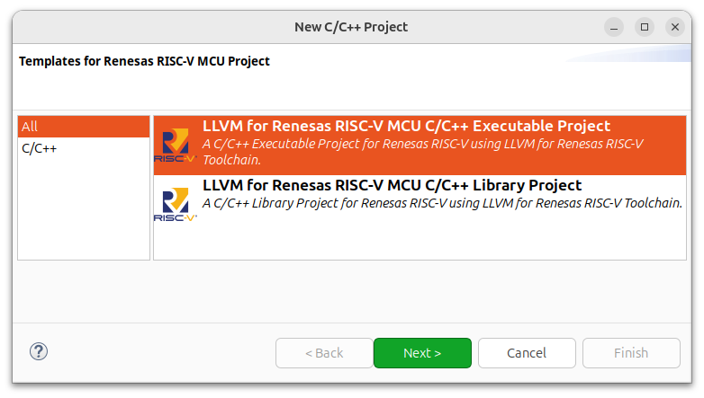
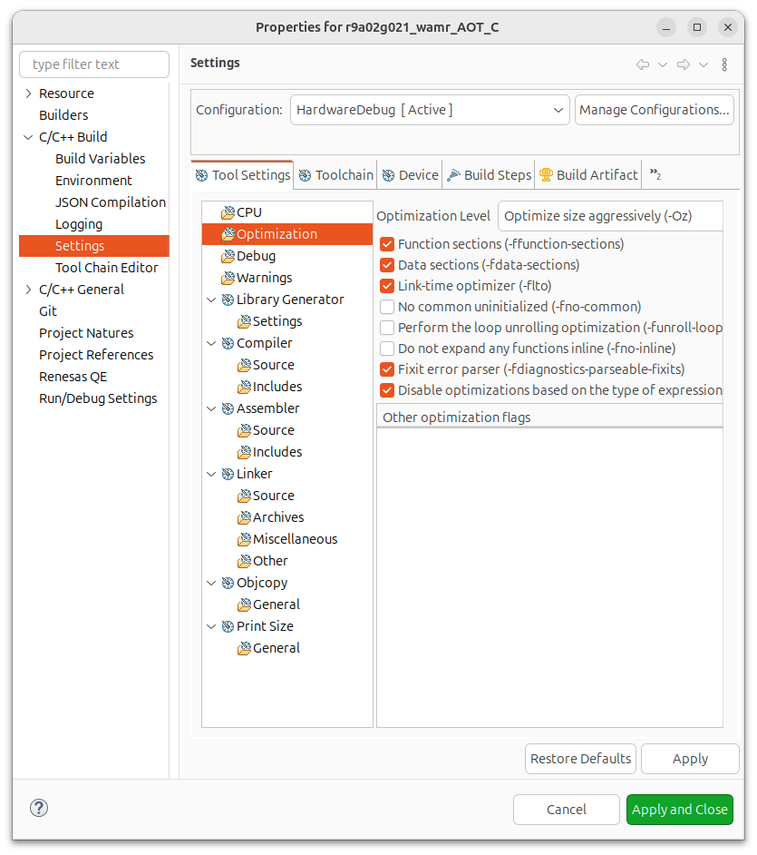
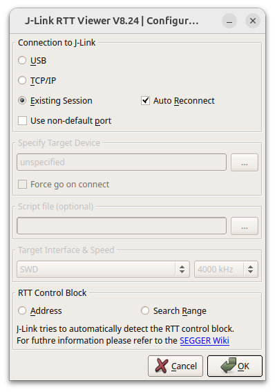
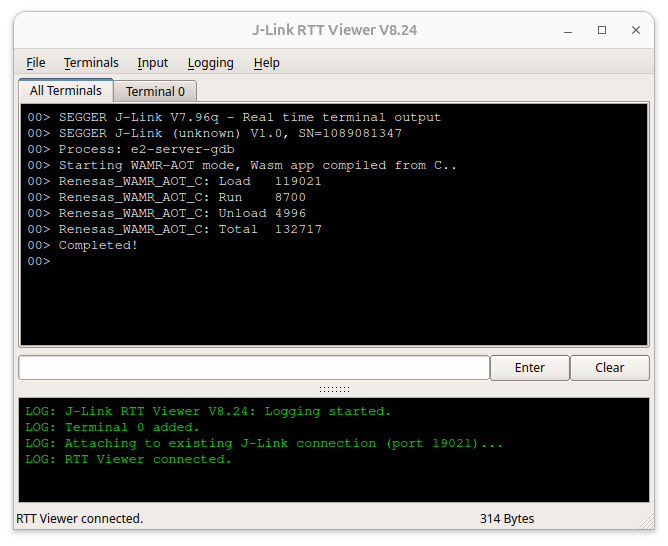

# Renesas FPB-R9A02G021 projects
This part evaluates the feasibility of applying Wasm and Lua to the Renesas FPB-R9A02G021 board and its performance.

**Note:** Lua's binary image file doesn't fit 128KB ROM, so an error happened at the linking step, so I expand the ROM size in the linker_script.ld to generate only an ELF file for code footprint comparison.

## 1. Hardware
- [FPB-R9A02G021 RISC-V MCU Fast Prototyping Board](https://www.renesas.com/en/products/microcontrollers-microprocessors/risc-v/fpb-r9a02g021-fpb-r9a02g021-risc-v-mcu-fast-prototyping-board)


## 2. Prerequisites
- [e2 studio for Renesas RISC-V](https://www.renesas.com/en/software-tool/e-studio-information-risc-v-mcu)
- [J-Link Software and Documentation Pack](https://www.segger.com/downloads/jlink/)
- In Linux, GDB requires Python 3.10 for debugging. If this version is not installed, this error will occur `libpython3.10.so.1.0: cannot open shared object file: No such file or directory`.

    ```
    sudo apt update
    sudo apt install libpython3.10
    ```


## 3. How to run
1. Download the r9a02g021 project to local.
2. Open project in e2 studio (`File > Open Project from File System`)
3. Build project
4. Connect the board to your PC and start debugging in e2 studio, or flash the image file to the board using `Renesas Flash Programmer` tool.
5. Open JLinkRTTViewer and connect to the board for real-time terminal interaction. Refer to section 6. below for details.


## 4. Renesas RISC-V Project Details
### 4.1 New project
All the projects for this board are ""LLVM for Renesas RISC-V MCU C/C++ Executable Project", with target board FPB-R9A02G021.



### 4.2 Project Configurations
Project configurations in e2 studio:
- Optimization: (actually, I focus on size optimization because the 128KB ROM is too small)
    - Optimize size aggressively (-Oz),
    - Function sections(-ffunction-sections)
    - Data sections(-fdata-sections)
    - Link-time optimizer (-flto)
- Include:
    - Include all source code directories in Compiler/Includes
    - Include all assembly code directories in Assembler/Includes
- Objcopy
    - Output format "Raw binary" to generate .bin file.



### 4.3 Create new functions for WAMR (WebAssembly-Micro-Runtime)
All new functions for WAMR are created under `src/renesas_bare_metal/` directory.

#### Memory Allocator for the two areas of ECCRAM(4KB) and RAM (12KB)
Modify the linker file to extract the start addresses and end addresses of free memory.

The simple memory allocator is provided in `renesas_riscv_malloc.c`.

Note that the return pointer and size should be aligned to 8 bytes to avoid unexpected errors in WAMR.
```
PROVIDE(__heap_eccram_start = __ebss_eccram);
PROVIDE(__heap_eccram_end = ORIGIN(ECCRAM) + LENGTH(ECCRAM));

PROVIDE(__heap_ram_start = __ebss);
PROVIDE(__heap_ram_end = __stack - __stack_size);
```

#### CPU cycle
The ```csrr``` assembly instruction in the RISC-V architecture is used to read the CPU cycle for runtime performance analysis.

The source code is provided in `renesas_riscv_cpu.c`.

#### printf
JLinkRTTViewer is used for real-time I/O interaction between the PC and the board. The RTT library is placed at `src/renesas_bare_metal/RTT`. The RTT buffer size for terminal output is defaulted by 1KB, but it can be adjusted.

The functions provided to WAMR are os_printf and os_vprintf, which are all redirected to SEGGER_RTT_vprintf.
Note: printf is a dangerous function, consider carefully whether you provide it to WAMR or not.


## 5. Wasm/Lua Runtimes
Runtimes:
- Wasm runtime: [WAMR 2.2.0](https://github.com/bytecodealliance/wasm-micro-runtime/releases/tag/WAMR-2.2.0)
- Lua runtime: [Lua 5.4.7](https://lua.org/download.html)

The runtimes were adjusted to adapt with each running mode in this board.
- WAMR: source code directory `src/wasm-micro-runtime`. 
    - New file `config_r9a02g021.h` is added to WAMR to store configurations for this plarform, and it's included to `config.h`
    - Execution modes: classic interpreter, fast interpreter, AoT compilation. All using normal loader. 
- Lua Interpreter: source code directory `src/lua-5.4.7`. 
    - Modify the configuration `src/luaconf.h` for platform architecture (LUA_32BITS) and max stack (LUAI_MAXSTACK).
    - The `lua.c` and `luac.c` should be excluded from the project.

Note: there are some additional adjustment while integrating WAMR/Lua into this project.

## 6. Debug/Test
### 6.1 Debugging in e2 studio
Debug from e2 studio via the J-Link debug probe.

Besides basic debugging features, memory and registers can also be monitored while debugging.

### 6.2 I/O interaction via JLinkRTTViewer
JLinkRTTViewer is a tool in the J-Link Software and Documentation Pack, supports real-time interaction between PC and the board via the J-Link debug probe.

JLinkRTTViewer Configuration:



JLinkRTTViewer output message example:


